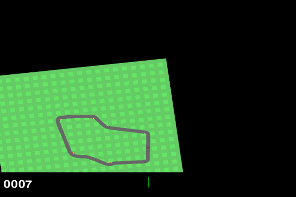

# Box2D CarRacing PPO

Implementation of Proximal Policy Optimization(PPO) algorithm using Pytorch for the
[`CarRacing-v2`](https://gymnasium.farama.org/environments/box2d/car_racing/)
Box2D environment from OpenAI's Gym library.

## Demo

This demo is just one of the best play out of 1500 of episodes, the
model does not actually play this well consistently 😅

## Note

The model are trained over 3000 episodes played, with 10 epochs per each episode.
After some testing, I found that the optimal batch size is the same size as the
episode's length, so basically performs one parameter update per each epoch
with all the data sampled within one episode. I've also limited the map pool size to 1000 maps,
so there can only be 1000 different tracks during training. The final model
was able to attain an average score of around 600 to 700.

I've also tried out different hyperparameters, and observed that the
biggest factor that affects the training performance was batch size
and map pool size. So far I've tested a variety of batch sizes but none of
them comes close to what I've end up with, which is as long as the episode's length.
I've also tried to change the map pool size to 10000 maps and unlimited maps, and was able to
see progress in the model with the a map pool size of 10000 maps but the performance was not as good
as the one with 1000 maps, and as for the model with unlimited map pool size, it barely shows
any improvement during training, at least in the span of 3000 episodes of training.

A plot of total score vs episode during training is shown below, gray line was
the model trained with a map pool size of 1000 maps, yellow line is 10000 maps, and the
cyan line is unlimited. I didn't finish all 3000 episodes of training
with the unlimited one because there's barely any improvement.

As the plot shows, smaller map pool sizes tends to perform better, but I've only
tested three different sizes so it might be not be true for all cases.

More plots are saved in tensorboard logs located under the [runs](./runs/)directory,
use `tensorboard --logdir=runs` to view them.

My guesses are that smaller map pool sizes are easier to train with less amount
of episodes, but the bigger sizes might eventually performs better with more
episodes of training, but it remains to be tested.

## Todo

* Further improve the model (e.g. try out different model architecture, or train
the model for longer than just 3000 episodes)